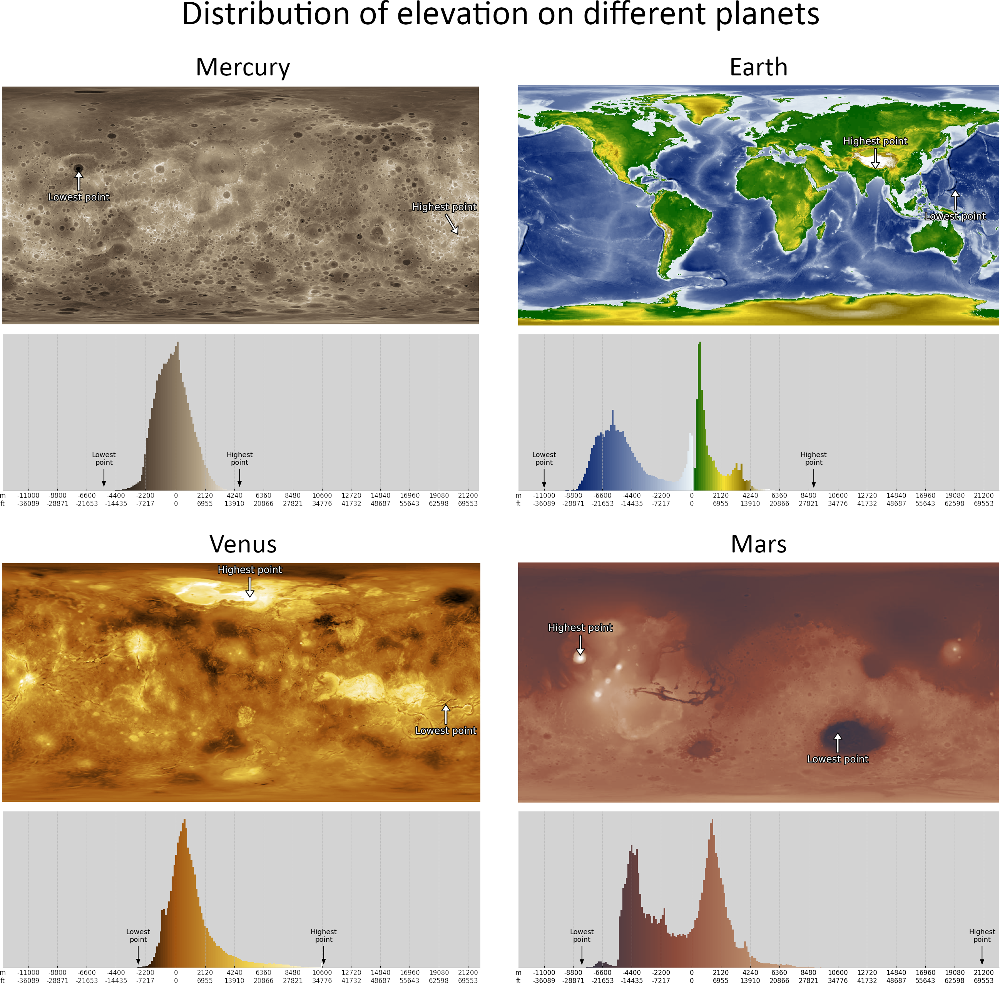

# Planet histograms

Earth has really interestingly distributed height profile. There are two clear peaks, one above ground and another below the sea. This is due to the history of water erosion. 

Mercury, Venus and Mars also have different height profiles based on their history. Mars clearly has similar peaks in height profile, possibly also due to water erosion and/or ancient meteor impact. Mercury and Venus have more craters.

We can apply a colormap to simulate different areas on Earth. We can apply the same colormap to the other bodies to visualize how they might look with sea, green areas, deserts and snow.

